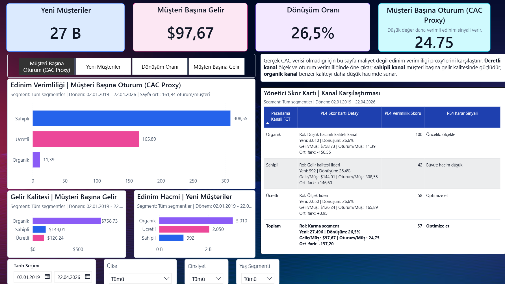
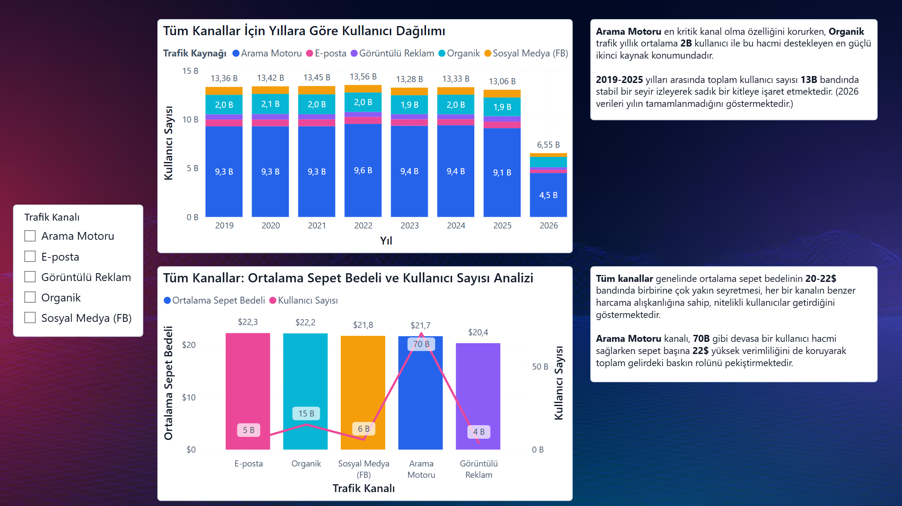
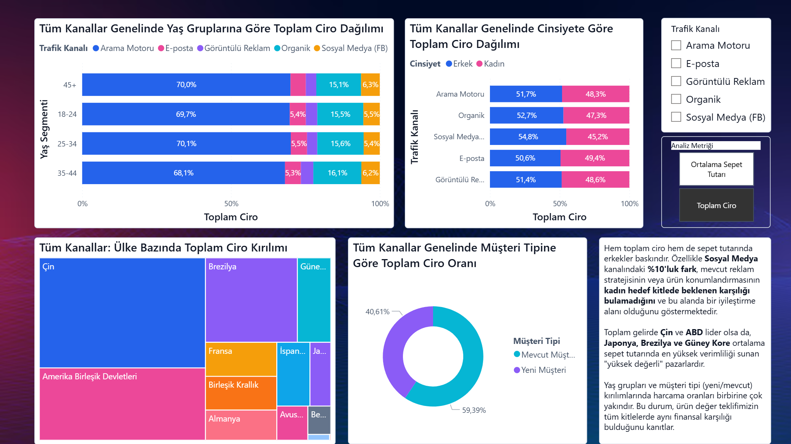

# E-commerce Analytics Engineering

[](https://github.com/senanurcetin/E-commerce/actions/workflows/ci.yml)


**Analytics engineering case study** — end-to-end pipeline built in **dbt Cloud**, warehoused in **BigQuery**, and visualized in **Power BI**. Transforms raw e-commerce clickstream events and order transactions into BI-ready mart tables through a 3-layer dbt architecture (staging → intermediate → marts).

The repo also runs fully on **DuckDB** (CI and local) using Jinja adapter dispatch, so every model and test can be reproduced without BigQuery access.

---

## Power BI Dashboard

Three-page dashboard built on `fct_marketing_web_performance`, `fct_order_marketing`, `dim_user`, and `dim_products` marts. Covers channel acquisition efficiency, time-series trends, and demographic segmentation.

### Page 1 — Channel Acquisition Efficiency & Executive Scorecard



| KPI | Value |
|-----|-------|
| New customers | 27 K |
| Revenue per customer | $97.67 |
| Conversion rate | 26.5% |
| Sessions per customer (CAC proxy) | 24.75 |

**Insight:** Organic leads in revenue quality ($758.73/customer, score 100 — "scale it"). Owned (email) dominates retention (308 sessions/customer). Paid is the volume engine but highest CAC proxy.

### Page 2 — Traffic Trend (2019–2026) & Basket Value by Channel



**Insight:** Total users stable at ~13 B per year (2019–2025) — loyal base. Search engine is the dominant channel (~9.3 B users/year), Organic is the strong #2 (~2 B/year). Average basket value is consistent across channels ($20–22) — all channels attract similar-quality spenders. Search engine maintains $22/basket at 70 B user scale, anchoring total revenue dominance.

### Page 3 — Demographics: Age, Gender, Country & Customer Type



**Insight:** Search engine's ~70% revenue share is uniform across all age groups and genders — channel mix is not demographic-dependent, it's volume-driven. Social media (FB) shows a 10-point gender gap (55% male) — female targeting opportunity. Japan, Brazil, and South Korea lead in average basket value despite lower total revenue — "high-value" markets for margin-focused expansion.

---

## Business Questions Answered

| Question | Model |
|----------|-------|
| Which marketing channels drive the most revenue and conversions? | `fct_order_marketing` + `fct_marketing_web_performance` |
| Where do users drop off in the purchase funnel? | `int_events_enriched` + `analyses/conversion_funnel.sql` |
| Which products have the highest return rates and net revenue? | `fct_order_marketing` + `analyses/top_products.sql` |
| How does channel performance compare across sessions and orders? | `analyses/channel_performance.sql` |

---

## Data Architecture

```
Raw Sources (BigQuery) / Seeds (DuckDB CI)
    events  order_items  products  users
              |
              v
    +-----------------------------------------+
    |         STAGING LAYER (views)           |
    |  stg_events  stg_order_items            |
    |  stg_products  stg_users                |
    |  - type casting (dbt.type_* macros)     |
    |  - null handling and normalization      |
    |  - country name normalization macro     |
    +-----------------------------------------+
              |
              v
    +-----------------------------------------+
    |       INTERMEDIATE LAYER (views)        |
    |  int_orders_enriched                    |
    |    order + product + user + attribution |
    |  int_events_enriched                    |
    |    event + user enrichment              |
    +-----------------------------------------+
              |
              v
    +-----------------------------------------+
    |          MARTS LAYER (tables)           |
    |  fct_order_marketing                    |
    |  fct_marketing_web_performance          |
    |  dim_user    dim_products               |
    |  - BI-ready, fully documented           |
    |  - partitioned + clustered (BigQuery)   |
    +-----------------------------------------+
              |
              v
    +-----------------------------------------+
    |         ANALYSIS QUERIES                |
    |  channel_performance.sql                |
    |  conversion_funnel.sql                  |
    |  top_products.sql                       |
    +-----------------------------------------+
```

---

## Models

### Staging (4 views)

| Model | Source | Key transformations |
|-------|--------|---------------------|
| `stg_events` | events | Type casting, event type normalization macro, null coalesce |
| `stg_order_items` | order_items | Type casting, status normalization, timestamp cleanup |
| `stg_products` | products | Type casting, name/brand/category normalization |
| `stg_users` | users | Country normalization macro (Espana->Spain, Brasil->Brazil), age casting |

### Intermediate (2 views)

| Model | Joins | Key logic |
|-------|-------|-----------|
| `int_orders_enriched` | order_items + products + users + events | Traffic attribution: nearest purchase event per order item via window function, fallback to signup source |
| `int_events_enriched` | events + users | User demographic enrichment on clickstream |

### Marts (4 tables)

| Model | Grain | Key columns |
|-------|-------|-------------|
| `fct_order_marketing` | Order item | `revenue`, `returned_revenue`, `channel_group`, `is_completed_order`, `order_date` |
| `fct_marketing_web_performance` | Session | `session_duration_seconds`, `is_converted`, `channel_group`, `page_view_events`, `session_date` |
| `dim_user` | User | `age_segment`, `signup_channel_group`, `country` (normalized) |
| `dim_products` | Product | `unit_margin`, `unit_margin_pct`, `product_name` (with fallback logic) |

### Macros (3)

| Macro | Purpose |
|-------|---------|
| `marketing_channel_group(source)` | Groups traffic sources: paid (facebook/youtube/adwords/display), owned (email), organic (search/organic), other |
| `normalize_event_type(source)` | Maps raw labels (Home, Product, Department) to page_view / cart / purchase / cancel |
| `normalize_country(source)` | Normalizes non-English country names — adapter-aware regex vs LIKE |

---

## SQL Analysis Queries

Three business analysis queries in `/analyses` — compile with `dbt compile --select analyses/`:

**`channel_performance.sql`** — Net revenue, order count, session conversion rate, and avg session duration by marketing channel and traffic source. Joins `fct_order_marketing` + `fct_marketing_web_performance`.

**`conversion_funnel.sql`** — Page_view to cart to purchase funnel drop-off by channel group. Identifies where acquisition spend is leaking.

**`top_products.sql`** — Product-level gross revenue, net revenue, return rate, and dual ranking (revenue vs return risk).

---

## Data Quality

**73 total dbt tests** across all layers:

| Layer | Tests | Scope |
|-------|-------|-------|
| Source | 19 | not_null, unique, freshness (BigQuery only) |
| Staging | 24 | not_null, unique, accepted_values, relationships |
| Intermediate | 6 | not_null, unique |
| Marts | 24 | not_null, unique, accepted_values, relationships |
| Custom SQL | 4 | Country alias removal, non-negative duration, page view presence, non-negative revenue |

**57 of 73 tests pass in CI** — source tests excluded (require BigQuery access).

---

## Cross-Adapter Compatibility

Models run on DuckDB (CI/local) and BigQuery (production) using Jinja adapter dispatch:

```sql
-- Timestamp diff

  TIMESTAMP_DIFF(max_ts, min_ts, SECOND)

  DATEDIFF('second', min_ts, max_ts)


-- First non-null in array

  ARRAY_AGG(col IGNORE NULLS ORDER BY seq LIMIT 1)[SAFE_OFFSET(0)]

  FIRST(col ORDER BY seq) FILTER (WHERE col IS NOT NULL)

```

Handled: TIMESTAMP_DIFF, TIMESTAMP_SUB/ADD, ARRAY_AGG IGNORE NULLS, COUNTIF, SAFE_DIVIDE, SAFE_SUBTRACT, DATETIME timezone, REGEXP_CONTAINS, type macros.

---

## End-to-End Workflow

```
dbt Cloud (IDE)
  → models authored and tested in dbt Cloud browser IDE
  → jobs scheduled and run against BigQuery warehouse
      ↓
BigQuery (Warehouse)
  → mart tables materialised as partitioned + clustered tables
  → source freshness monitored via dbt source tests
      ↓
Power BI (Dashboard)
  → mart tables connected as DirectQuery or import datasets
  → channel performance, funnel, and product revenue dashboards
      ↓
GitHub (Version control + CI)
  → all SQL and YAML versioned here
  → CI re-runs seed + run + test on DuckDB for every push
```

> **Power BI screenshots:** add your dashboard images to `docs/assets/` and reference them here. Suggested names: `powerbi-channel-performance.png`, `powerbi-funnel.png`, `powerbi-product-revenue.png`.

---

## Stack

| Layer | Technology |
|-------|-----------|
| Authoring IDE | dbt Cloud (browser-based IDE) |
| Transformation | dbt 1.x |
| Production warehouse | BigQuery |
| BI / Dashboards | Power BI |
| CI / Local adapter | DuckDB (persistent file, no BigQuery needed) |
| Packages | dbt-labs/dbt_utils 1.x |
| Version control + CI | GitHub Actions |

---

## Local Setup

```bash
pip install dbt-duckdb

dbt deps --profiles-dir .github/dbt-profiles

# Load 57 sample rows across 4 tables
dbt seed --profiles-dir .github/dbt-profiles

# Run all 10 models
dbt run --profiles-dir .github/dbt-profiles

# Run 57 data quality tests
dbt test --profiles-dir .github/dbt-profiles --exclude "source:*"

# Compile analysis queries (view generated SQL without running)
dbt compile --profiles-dir .github/dbt-profiles --select analyses/
```

**Production (BigQuery):** configure `~/.dbt/profiles.yml` pointing to `workintech-working.e_ticaret`, then run without `--profiles-dir`.

---

## Proof Surfaces

| Document | Contents |
|----------|----------|
| [`docs/hiring-summary.md`](docs/hiring-summary.md) | Recruiter-facing one-page summary with talking points |
| [`models/marts/marts.yml`](models/marts/marts.yml) | Full column-level docs for all 4 mart tables |
| [`analyses/`](analyses/) | Three business SQL analysis queries |
| [`docs/assets/powerbi-channel-performance.png`](docs/assets/powerbi-channel-performance.png) | Power BI — Page 1: channel acquisition efficiency + executive scorecard |
| [`docs/assets/powerbi-traffic-trend.png`](docs/assets/powerbi-traffic-trend.png) | Power BI — Page 2: traffic trend 2019–2026 + basket value by channel |
| [`docs/assets/powerbi-demographics.png`](docs/assets/powerbi-demographics.png) | Power BI — Page 3: age, gender, country, and customer type segmentation |
| CI badge | Passing: seed + run + test (57 tests) on every push |

---

## Limitations

- Source tests (19) require BigQuery access — excluded from CI
- Timezone conversion falls back to UTC in DuckDB (no ICU extension required)
- Seed data is 57 sample rows — representative structure, not statistically significant
- Production BigQuery credentials are not part of this public repo

---

## License

MIT
