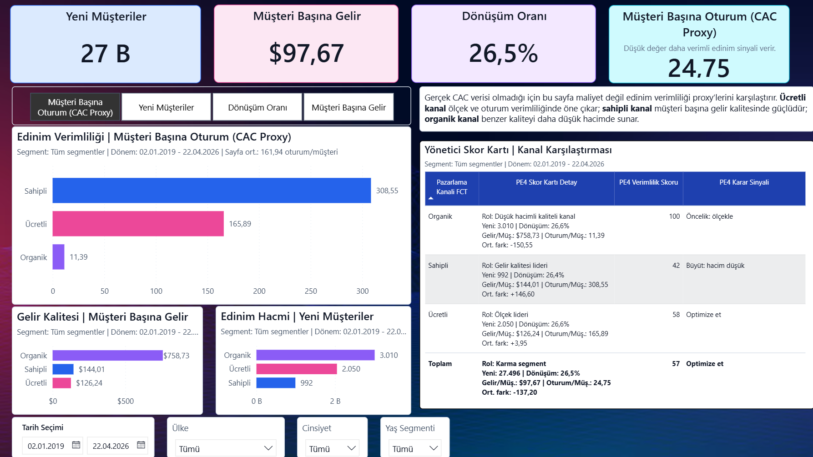
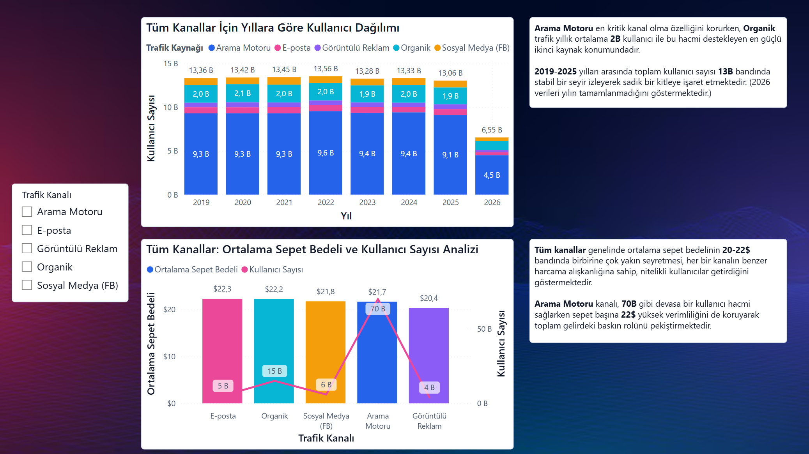
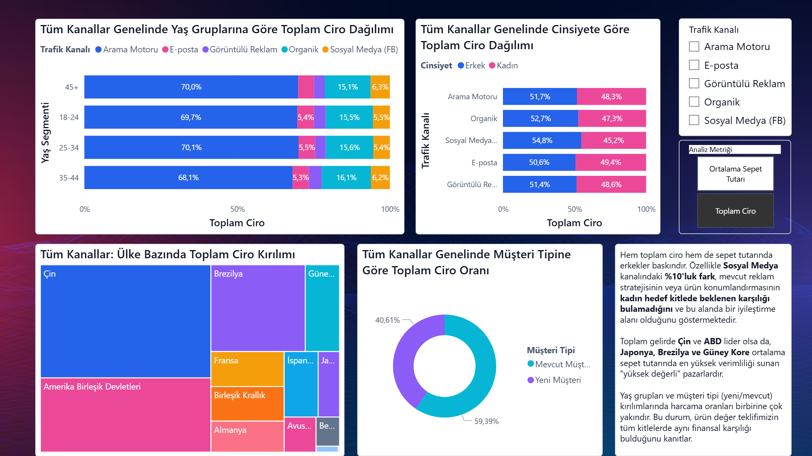

# E-commerce Analytics Engineering

[](https://github.com/senanurcetin/E-commerce/actions/workflows/ci.yml)


**Analytics engineering case study** — end-to-end pipeline built in **dbt Cloud**, warehoused in **BigQuery**, and visualized in **Power BI**. Transforms raw e-commerce clickstream events and order transactions into BI-ready mart tables through a 3-layer dbt architecture (staging → intermediate → marts).

The repo also runs fully on **DuckDB** (CI and local) using Jinja adapter dispatch, so every model and test can be reproduced without BigQuery access.

### What is in this repo

Two separate datasets live here. The dbt pipeline is the main body of work; the
Olist notebooks are a standalone analysis kept alongside it.

| Dataset | Scale | Used by | Tooling |
|---------|-------|---------|---------|
| **E-commerce clickstream and orders** — the main project | 2.4 M events, 180 K order lines, 100 K users | dbt models, `analyses/`, all three Power BI pages | dbt, BigQuery, DuckDB, Power BI |
| **Olist Brazilian e-commerce** (public Kaggle set) | 99 K orders | `notebooks/` | Python, DuckDB |

---

## Power BI Dashboard

Three-page dashboard built on `fct_marketing_web_performance`,
`fct_order_marketing`, `dim_user` and `dim_products`.

**A note on units.** The report is authored in Turkish, where thousands are
abbreviated **B** (*bin*). So "13,36 B" on page 2 is 13,360 — not 13 billion.
Every figure below is given in full to avoid that reading.

**A note on two source columns.** The project carries two different traffic
vocabularies and they are not interchangeable:

| Column | Values | Meaning |
|--------|--------|---------|
| `dim_user.signup_traffic_source` | search, organic, facebook, email, display | How the *user* was acquired at signup. Pages 2–3 group by this |
| `fct_marketing_web_performance.traffic_source` | email, adwords, youtube, facebook, organic | Source of the *session*. Page 1 and the funnel analyses use this |

#### Page 1 — Channel Acquisition Efficiency & Executive Scorecard



| KPI | Value |
|-----|-------|
| New customers | 27 K |
| Revenue per customer | $97.67 |
| Conversion rate | 26.5% |
| Sessions per customer (CAC proxy) | 24.75 |

**Insight:** A PE4 scorecard ranks the three channel groups on acquisition
efficiency. Organic scores 100 — "priority: scale" — on revenue quality at
$758.73 per customer against only 11.39 sessions per customer. Owned leads on
engagement at 308.55 sessions per customer but $144.01 revenue per customer.
Paid is the scale leader in between. The page states its own main caveat: with
no spend data these are efficiency *proxies*, not cost figures.

**Where that ranking does not come from.** Conversion is flat across the groups
— 26.6%, 26.4%, 26.6% against a 26.5% overall rate — and that is not rounding.
Tested across the five session-level sources, a chi-square test does not reject
the hypothesis that they convert equally (χ² = 6.73, df = 4, p = 0.15, over
680,450 sessions), and at that sample size a real difference of well under a
percentage point would be detectable. So the scorecard's ranking rests on
revenue per customer and sessions per customer; conversion carries no signal
here. Reproduce with
[`analyses/channel_conversion_significance.sql`](analyses/channel_conversion_significance.sql).

#### Page 2 — Signups by Year & Basket Value by Acquisition Channel



**Insight:** Signups are flat at roughly **13,300 users per year** from 2019 to
2025; 2026 sits at 6,554 because the year is incomplete, not because acquisition
fell. Search is the dominant acquisition channel at **69,926 users (69.9%)**,
organic second at **15,077 (15.1%)**, then facebook 5,919, email 5,102 and
display 3,976 — 100,000 users in total. Average basket value lands between
**$20.40 and $22.30** across all five channels, so the channels differ in reach,
not in what their users spend per order.

#### Page 3 — Demographics: Age, Gender, Country & Customer Type



**Insight:** Search takes **68.1% to 70.1%** of revenue in every age bracket
from 18-24 to 45+, so channel mix is driven by acquisition volume rather than by
demographics. Gender splits are near even for most channels (50.6% to 52.7%
male), with social media the outlier at **54.8% male** — a gap worth probing
before it is read as a targeting opportunity. China and the United States lead
total revenue, while Japan, Brazil and South Korea index highest on average
basket value at lower volume. Existing customers account for **59.4%** of
revenue against **40.6%** from new.

---

## Business Questions Answered

| Question | Model |
|----------|-------|
| Which marketing channels drive the most revenue and conversions? | `fct_order_marketing` + `fct_marketing_web_performance` |
| Where do users drop off in the purchase funnel? | `int_events_enriched` + `analyses/conversion_funnel.sql` |
| Which products have the highest return rates and net revenue? | `fct_order_marketing` + `analyses/top_products.sql` |
| How does channel performance compare across sessions and orders? | `analyses/channel_performance.sql` |

---

## Data Architecture

```
Raw Sources (BigQuery) / Seeds (DuckDB CI)
    events  order_items  products  users
              |
              v
    +-----------------------------------------+
    |         STAGING LAYER (views)           |
    |  stg_events  stg_order_items            |
    |  stg_products  stg_users                |
    |  - type casting (dbt.type_* macros)     |
    |  - null handling and normalization      |
    |  - country name normalization macro     |
    +-----------------------------------------+
              |
              v
    +-----------------------------------------+
    |       INTERMEDIATE LAYER (views)        |
    |  int_orders_enriched                    |
    |    order + product + user + attribution |
    |  int_events_enriched                    |
    |    event stream at event grain          |
    +-----------------------------------------+
              |
              v
    +-----------------------------------------+
    |          MARTS LAYER (tables)           |
    |  fct_order_marketing                    |
    |  fct_marketing_web_performance          |
    |  dim_user    dim_products               |
    |  - BI-ready, fully documented           |
    |  - incremental order fact               |
    +-----------------------------------------+
              |
              v
    +-----------------------------------------+
    |         ANALYSIS QUERIES                |
    |  channel_performance.sql                |
    |  conversion_funnel.sql                  |
    |  top_products.sql                       |
    |  channel_conversion_significance.sql    |
    +-----------------------------------------+
```

---

## Models

### Staging (4 views)

| Model | Source | Key transformations |
|-------|--------|---------------------|
| `stg_events` | events | Type casting, event type normalization macro, null coalesce |
| `stg_order_items` | order_items | Type casting, status normalization, timestamp cleanup |
| `stg_products` | products | Type casting, name/brand/category normalization |
| `stg_users` | users | Country normalization macro (Espana->Spain, Brasil->Brazil), age casting |

### Intermediate (2 views)

| Model | Joins | Key logic |
|-------|-------|-----------|
| `int_orders_enriched` | order_items + products + users + events | Traffic attribution: nearest purchase event per order item via window function, fallback to signup source |
| `int_events_enriched` | events | Cleaned clickstream at event grain. User attributes are joined in the marts layer against `dim_user`, not here |

### Marts (4 tables)

| Model | Grain | Key columns |
|-------|-------|-------------|
| `fct_order_marketing` | Order item | `revenue`, `returned_revenue`, `channel_group`, `is_completed_order`, `order_date` — **incremental** (unique key: `order_item_sk`) |
| `fct_marketing_web_performance` | Session | `session_duration_seconds`, `is_converted`, `channel_group`, `page_view_events`, `session_date` |
| `dim_user` | User | `age_segment`, `signup_channel_group`, `country` (normalized) |
| `dim_products` | Product | `unit_margin`, `unit_margin_pct`, `product_name` (with fallback logic) |

### Macros (3)

| Macro | Purpose |
|-------|---------|
| `marketing_channel_group(source)` | Groups traffic sources: paid (facebook/youtube/adwords/display), owned (email), organic (search/organic), other |
| `normalize_event_type(source)` | Maps raw labels (Home, Product, Department) to page_view / cart / purchase / cancel |
| `normalize_country(source)` | Normalizes non-English country names — adapter-aware regex vs LIKE |

---

## Python Analysis Notebook — Olist E-Commerce

[`notebooks/olist-ecommerce-analysis.ipynb`](notebooks/olist-ecommerce-analysis.ipynb)

Standalone Python analysis on the [Olist Brazilian E-Commerce dataset](https://www.kaggle.com/datasets/olistbr/brazilian-ecommerce) (99K orders, 2016–2018). Covers the full analytical workflow from EDA through statistical hypothesis testing.

**Kaggle notebook:** [Olist: p = 0 Is Not a Finding](https://www.kaggle.com/code/senanuretin/olist-p-0-is-not-a-finding) revisits the three tests below with effect sizes and bootstrap intervals: delivery speed d = 0.36 (small), category η² = 0.038 (small), payment method V = 0.035 (negligible) — and delivery *after the promised date* d = 1.45 (large).

| Section | Tools | Key finding |
|---------|-------|-------------|
| EDA + Descriptive Stats | pandas, plotly | Avg order: 120 BRL, avg delivery: 12 days, avg review: 4.09/5 |
| Correlation analysis | scipy, plotly | Delivery time negatively correlated with satisfaction |
| **T-test** — Delivery speed → satisfaction | `scipy.stats.ttest_ind` | p ≈ 0: fast delivery significantly higher review scores |
| **ANOVA** — Product category → order value | `scipy.stats.f_oneway` | Significant price differences across top 10 categories |
| **Chi-square** — Payment method → completion rate | `scipy.stats.chi2_contingency` | Payment type significantly affects completion rate |

**Hypotheses tested:**

```
H0: Teslimat hızı müşteri memnuniyetini etkilemez  →  REDDEDİLDİ (p ≈ 0)
H0: Ürün kategorisinin sipariş değerine etkisi yok →  REDDEDİLDİ
H0: Ödeme yöntemi tamamlama oranını etkilemez     →  REDDEDİLDİ
```

---

## SQL Analysis Queries

Four analysis queries in `/analyses` — compile with `dbt compile --select analyses/`:

**`channel_performance.sql`** — Net revenue, order count, session conversion rate, and avg session duration by marketing channel and traffic source. Joins `fct_order_marketing` + `fct_marketing_web_performance`.

**`conversion_funnel.sql`** — Page_view to cart to purchase funnel drop-off by channel group. Identifies where acquisition spend is leaking.

**`top_products.sql`** — Product-level gross revenue, net revenue, return rate, and dual ranking (revenue vs return risk).

**`channel_conversion_significance.sql`** — Chi-square test of whether the conversion gaps between channels are real. Returns χ² = 6.73 on df = 4 (p = 0.15), so they are not: the ranking in `channel_performance.sql` reflects volume, not performance. Runs on both adapters.

---

## Data Quality

**73 total dbt tests** across all layers:

| Layer | Tests | Scope |
|-------|-------|-------|
| Source | 16 | not_null, unique, freshness (BigQuery only) |
| Staging | 23 | not_null, unique, accepted_values, relationships |
| Intermediate | 6 | not_null, unique |
| Marts | 24 | not_null, unique, accepted_values, relationships |
| Custom SQL | 4 | Country alias removal, non-negative duration, page view presence, non-negative revenue |

**57 of 73 tests pass in CI** — source tests excluded (require BigQuery access).

---

## Cross-Adapter Compatibility

Models run on DuckDB (CI/local) and BigQuery (production) using Jinja adapter dispatch:

```sql
-- Timestamp diff

  TIMESTAMP_DIFF(max_ts, min_ts, SECOND)

  DATEDIFF('second', min_ts, max_ts)


-- First non-null in array

  ARRAY_AGG(col IGNORE NULLS ORDER BY seq LIMIT 1)[SAFE_OFFSET(0)]

  FIRST(col ORDER BY seq) FILTER (WHERE col IS NOT NULL)

```

Handled: TIMESTAMP_DIFF, TIMESTAMP_SUB/ADD, ARRAY_AGG IGNORE NULLS, COUNTIF, SAFE_DIVIDE, SAFE_SUBTRACT, DATETIME timezone, REGEXP_CONTAINS, type macros.

---

## End-to-End Workflow

```
dbt Cloud (IDE)
  → models authored and tested in dbt Cloud browser IDE
  → jobs scheduled and run against BigQuery warehouse
      ↓
BigQuery (Warehouse)
  → mart tables materialised as tables, with the order fact incremental
  → source freshness configured on the raw tables (run manually; CI has no
    warehouse credentials)
      ↓
Power BI (Dashboard)
  → mart tables connected as DirectQuery or import datasets
  → channel performance, funnel, and product revenue dashboards
      ↓
GitHub (Version control + CI)
  → all SQL and YAML versioned here
  → CI re-runs seed + run + test on DuckDB for every push
```

> **Power BI screenshots:** add your dashboard images to `docs/assets/` and reference them here. Suggested names: `powerbi-channel-performance.png`, `powerbi-funnel.png`, `powerbi-product-revenue.png`.

---

## Stack

| Layer | Technology |
|-------|-----------|
| Authoring IDE | dbt Cloud (browser-based IDE) |
| Transformation | dbt 1.x |
| Production warehouse | BigQuery |
| BI / Dashboards | Power BI |
| CI / Local adapter | DuckDB (persistent file, no BigQuery needed) |
| Packages | dbt-labs/dbt_utils 1.x |
| Version control + CI | GitHub Actions |

---

## Local Setup

```bash
pip install dbt-duckdb

dbt deps --profiles-dir .github/dbt-profiles

# Load 57 sample rows across 4 tables
dbt seed --profiles-dir .github/dbt-profiles

# Run all 10 models
dbt run --profiles-dir .github/dbt-profiles

# Run 57 data quality tests
dbt test --profiles-dir .github/dbt-profiles --exclude "source:*"

# Compile analysis queries (view generated SQL without running)
dbt compile --profiles-dir .github/dbt-profiles --select analyses/
```

**Production (BigQuery):** configure `~/.dbt/profiles.yml` pointing to `workintech-working.e_ticaret`, then run without `--profiles-dir`.

---

## Proof Surfaces

| Document | Contents |
|----------|----------|
| [`docs/hiring-summary.md`](docs/hiring-summary.md) | Recruiter-facing one-page summary with talking points |
| [`models/marts/marts.yml`](models/marts/marts.yml) | Full column-level docs for all 4 mart tables |
| [`analyses/`](analyses/) | Four SQL analysis queries, including a chi-square significance test |
| [`notebooks/olist-ecommerce-analysis.ipynb`](notebooks/olist-ecommerce-analysis.ipynb) | Python EDA + T-test + ANOVA + Chi-square on 99K order dataset |
| [`notebooks/olist-sql-analysis.ipynb`](notebooks/olist-sql-analysis.ipynb) | DuckDB SQL: monthly trend, category ranking, RFM, cohort retention, delivery bands |
| [`docs/dax-measures.md`](docs/dax-measures.md) | Power BI DAX measures — KPIs, PE4 efficiency score, YoY, channel ratios |
| [`docs/assets/powerbi-channel-performance.png`](docs/assets/powerbi-channel-performance.png) | Power BI — Page 1: channel acquisition efficiency + PE4 executive scorecard |
| [`docs/assets/powerbi-traffic-trend.png`](docs/assets/powerbi-traffic-trend.png) | Power BI — Page 2: signups by year + basket value by acquisition channel |
| [`docs/assets/powerbi-demographics.png`](docs/assets/powerbi-demographics.png) | Power BI — Page 3: age, gender, country, and customer-type segmentation |
| CI badge | Passing: seed + run + test (57 tests) on every push |

---

## Documentation Review — September 2026

The documentation was audited against the code and the warehouse. Four claims
did not hold and have been corrected here rather than left standing:

- **"Partitioned + clustered mart tables"** appeared in three places. No model
  carried a `partition_by` or `cluster_by` config and none of the four mart
  tables in BigQuery were partitioned or clustered — the configs were dropped
  when the models were made cross-adapter. The claim is removed rather than the
  partitioning restored: at 680K and 180K rows the benefit is marginal, and the
  documentation should not drive the architecture.
- **The analysis count** still read three after a fourth query was added.
- **The DAX document** opened by claiming 50 measures; it contains 31
  definitions. It now states what it documents.
- **Source freshness** was described as catching stale data before it reached
  Power BI. It is configured on three of the four raw tables, needs BigQuery
  credentials so it cannot run in CI, and currently reports stale because the
  source has not been reloaded since April. All three facts are now stated.
- **The test breakdown did not add up.** The table above listed 19 source and 24
  staging tests against a stated total of 73, but the column summed to 77. The
  real counts are 16 and 23, which reconcile both with the total and with the 57
  that run in CI.

One defect was in the code rather than the docs: `int_events_enriched` joined
user attributes onto every event row. Nothing downstream read them, and the join
pulled names and email addresses into a view queryable by anyone with dataset
access. The join is removed and the model is now fully documented at 14 columns.

Left open deliberately: 16 columns across the staging and intermediate layers
have no description. Every mart column does, and the marts are what the BI layer
reads, so this is a gap rather than a defect.

## Limitations

- Source tests (16) require BigQuery access — excluded from CI
- Timezone conversion falls back to UTC in DuckDB (no ICU extension required)
- Seed data is 57 sample rows — representative structure, not statistically significant
- Production BigQuery credentials are not part of this public repo
- Session conversion shows no measurable relationship to traffic source
  (χ² = 6.73, df = 4, p = 0.15 over 680,450 sessions). Rankings by conversion are
  not meaningful on this data; revenue and volume metrics still are
- No cost or spend data, so ROI and true CAC cannot be computed — the "CAC proxy"
  on page 1 is a sessions-per-customer ratio, as the dashboard itself states

---

## License

MIT
